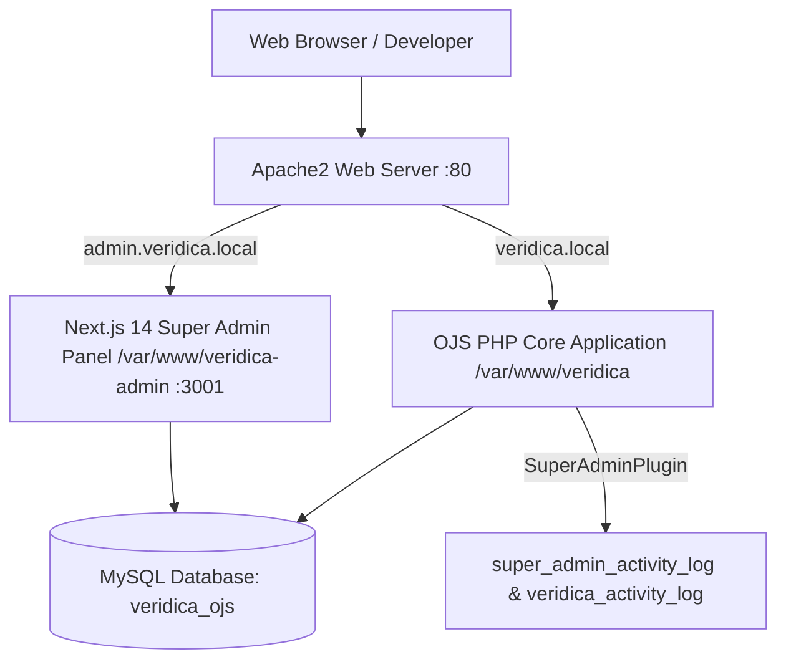

# Veridica Academic Network & OJS Super Admin Oversight Panel
## Developer Handover & System Documentation

**Date**: September 28, 2026  
**Project**: Veridica Open Journal Systems (OJS 3.4.0-5 Custom Build) & Super Admin Oversight Panel

---

## 1. 🔑 Test Accounts & System Credentials

### Standard Test Accounts Matrix
All standard test accounts use the default password: **`Password123!`**

| Role | Username | Email | Password | Allowed Access |
| :--- | :--- | :--- | :--- | :--- |
| **Site Admin / Super Admin** | `superadmin` | `admin@veridica.com` | `admin12345` / `Password123!` | Full Site Admin & Super Admin Oversight Panel |
| **Journal Manager** | `manager1` | `manager@veridica.com` | `Password123!` | Journal Settings, Submissions, Users |
| **Editor** | `editor1` | `test.editor@veridica.com` | `Password123!` | Editorial Workflow, Review Assignments & Decisions |
| **Author** | `author1` | `test.author@veridica.com` | `Password123!` | Manuscript Submission & Author Revisions |
| **Reviewer** | `reviewer1` | `test.reviewer@veridica.com` | `Password123!` | Peer Review Assignments & Confirmations |
| **Copyeditor** | `copyeditor1` | `test.copyeditor@veridica.com` | `Password123!` | Copyediting Stage Assignments |
| **Layout Editor** | `layouteditor1` | `layouteditor@veridica.com` | `Password123!` | Layout Editing Stage |
| **Proofreader** | `proofreader1` | `proofreader@veridica.com` | `Password123!` | Production & Proofreading Stage |
| **Subscription Manager** | `submanager1` | `submanager@veridica.com` | `Password123!` | Subscriptions Management |
| **Reader** | `reader1` | `reader@veridica.com` | `Password123!` | Public Article Reading & Downloads |

---

## 2. 🌐 Environment & Infrastructure

### Service Endpoints & Ports

* **Main OJS Journal Frontend**: `http://veridica.local`
  * **Local Directory**: `/home/vivek/WEBBHEADSS/company projects/ojspavankumar/ojs`
  * **Symlink**: `/var/www/veridica`
  * **Web Server**: Apache2 (VirtualHost: `veridica.local`)
* **Super Admin Oversight Panel (Next.js 14)**: `http://admin.veridica.local`
  * **Local Directory**: `/var/www/veridica-admin`
  * **Runtime**: Node.js v20+ listening on `127.0.0.1:3001` via Apache Reverse Proxy
* **Database Connection**:
  * **Engine**: MySQL 8.0 / MariaDB
  * **Database**: `veridica_ojs`
  * **User**: `ojs_user`
  * **Password**: `Veridica@2026#Secure`
  * **Host/Port**: `127.0.0.1:3306`

---

## 3. 🏗️ Architecture & Component Overview



### Key Repositories & Modules

1. **OJS Core Application (`/var/www/veridica`)**:
   * OJS 3.4.0-5 PKP framework customized for Veridica branding.
   * Branding stylesheet located at `public/journals/1/styleSheet.css`.
2. **Super Admin Generic Plugin (`plugins/generic/superAdmin/`)**:
   * Registers event listeners for both Laravel framework events and legacy PKP hooks.
   * `SuperAdminPlugin.php`: Captures real-time activity log entries into `super_admin_activity_log`.
   * `SuperAdminHandler.php`: Handles internal PKP API endpoints (`getUsers`, `getActivityLogs`, `getStats`).
3. **Next.js Oversight Application (`/var/www/veridica-admin`)**:
   * NextAuth.js authentication linked to `super_admin_activity_log` / `users` database tables.
   * Features: `/dashboard`, `/users` (Directory & Suspension toggle), `/activity` (Real-time audit log), `/metrics` (Visual charts), `/settings/mfa` (TOTP MFA), and `/api/export/pdf` (Branded PDF report generator).

---

## 4. ✅ Verified Super Admin Event Hooks

All **6 platform oversight event hooks** have been tested and verified live:

| Hook Event | Trigger Condition | PKP / Laravel Listener | Log Payload Example | Status |
| :--- | :--- | :--- | :--- | :---: |
| **`login`** | User authenticates on platform | `Illuminate\Auth\Events\Login` | `{"username":"author1"}` | ✅ Verified |
| **`file_uploaded`** | Manuscript file attached | `SubmissionFile::add` | `{"submission_id":1,"file_id":101,"file_name":"manuscript_v1.pdf"}` | ✅ Verified |
| **`submission_submitted`** | Manuscript submission completed | `PKP\observers\events\SubmissionSubmitted` | `{"submission_id":1}` | ✅ Verified |
| **`review_assigned`** | Reviewer assigned by editor | `ReviewAssignment::add` | `{"submission_id":1,"reviewer_id":6}` | ✅ Verified |
| **`review_accepted`** | Reviewer confirms assignment | `ReviewerAction::confirmReview` | `{"submission_id":1}` | ✅ Verified |
| **`decision_added`** | Editorial decision recorded | `PKP\observers\events\DecisionAdded` | `{"submission_id":1,"decision":1}` | ✅ Verified |

---

## 5. 🗄️ Core Activity Log Database Schema

### `super_admin_activity_log` Table Structure

```sql
CREATE TABLE `super_admin_activity_log` (
  `id` bigint NOT NULL AUTO_INCREMENT,
  `log_id` bigint DEFAULT NULL,
  `user_id` bigint DEFAULT NULL,
  `journal_id` bigint DEFAULT NULL,
  `event_type` varchar(255) NOT NULL,
  `event_detail` longtext,
  `action_detail` longtext GENERATED ALWAYS AS (`event_detail`) VIRTUAL,
  `ip_address` varchar(45) DEFAULT NULL,
  `created_at` datetime DEFAULT CURRENT_TIMESTAMP,
  PRIMARY KEY (`id`)
);
```

---

## 6. 🚀 How to Run & Maintain the Application

### 1. Rebuilding Next.js Super Admin Application
If changes are made to `/var/www/veridica-admin`:

```bash
cd /var/www/veridica-admin
npm run build
```

### 2. Starting Next.js Production Daemon
To keep the Next.js service running on port 3001:

Using PM2 (Recommended):
```bash
cd /var/www/veridica-admin
pm2 start npm --name "veridica-admin" -- start -- -p 3001
pm2 save
```

Or using systemd service (`/etc/systemd/system/veridica-admin.service`):
```ini
[Unit]
Description=Veridica Super Admin Next.js App
After=network.target

[Service]
Type=simple
User=vivek
WorkingDirectory=/var/www/veridica-admin
ExecStart=/usr/bin/npm start -- -p 3001
Restart=always

[Install]
WantedBy=multi-user.target
```

---

## 7. 📌 Remaining Scope & Developer Handover Checklist

* [ ] **PM2 / Systemd Daemon Setup**: Ensure `/var/www/veridica-admin` is registered under PM2 or systemd so port 3001 restarts automatically on system reboots.
* [ ] **Mobile Responsiveness Polish (Phase 5)**: Audit mobile viewport tables and charts on `/activity` and `/metrics`.
* [ ] **Custom Email Templates**: Review and adjust email text in `registry/emailTemplates.xml` if additional custom transactional emails are requested.
